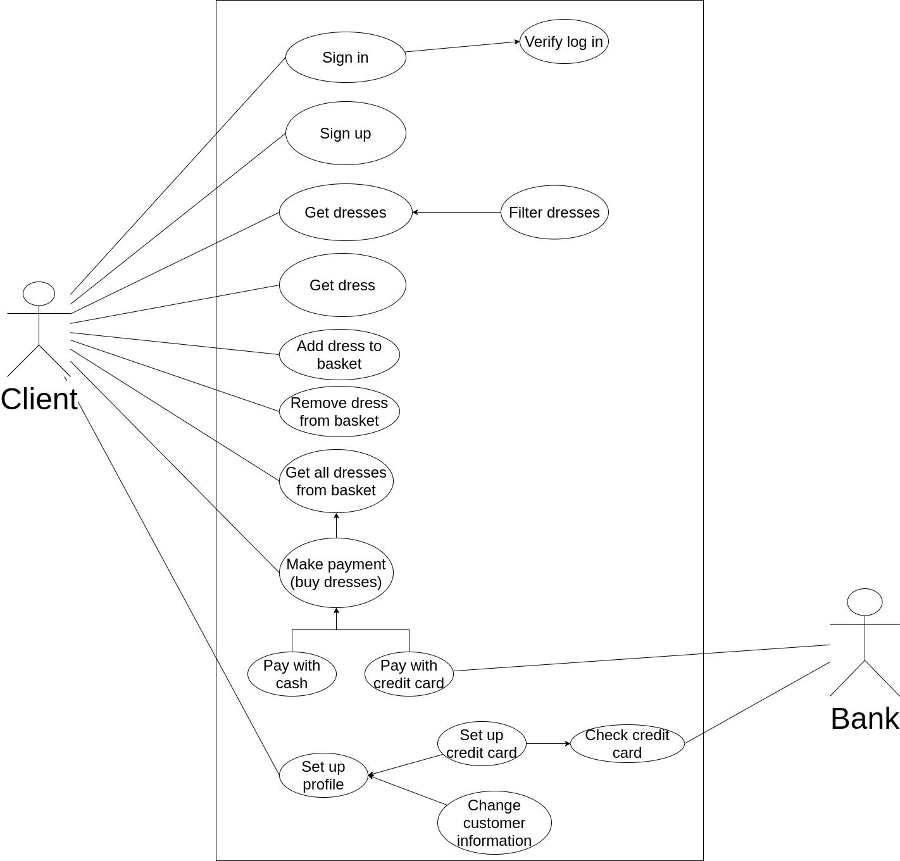
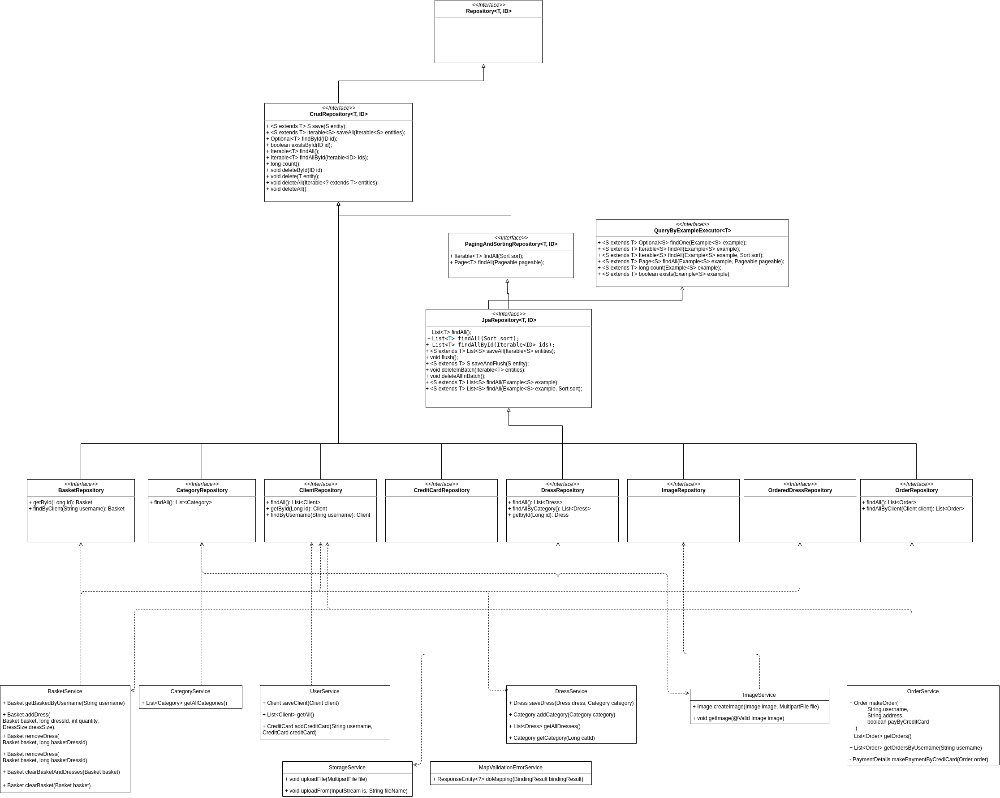

# Лабораторная работа №1

## Тема: проаграммная реализация доступа к данным

Миневска Ани Стоянова  
ИУ7И-66Б

### 1. Use-Case диаграмма

### 2. ER диаграмма сущностей

### 3. Технологический стек

Используемые технологии и подходы:

back-end:
 - Язык программирования Java
 - Spring Web - MVC фреймворк
 - Spring Data JPA - ORM для работы с SQL БД

android:
 - OkHttp
 
 
### 4. UML диаграмма классов для двух отдельных компонентов из курсового - компонент доступа к данным и компонент с бизнес логикой

### Программная реализация компонента доступа к данным

Реализация находится в [repository package](../../mallinicouture-back-end/src/main/java/io/mallinicouture/backend/repository)

 